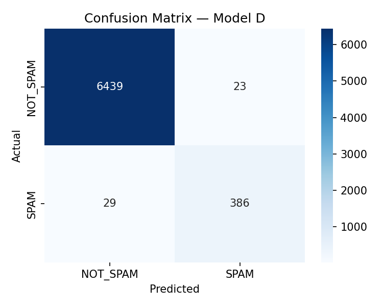
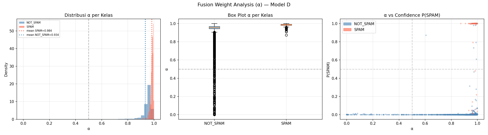

<p align="center">
  
  
  
  
  
  
</p>

<h1 align="center">JudiGone</h1>

<p align="center">
  <strong>Online Gambling Spam Detection in Indonesian YouTube Comments<br>
  using Modality-Aware Gated Fusion</strong>
</p>

<p align="center">
  <sub>Undergraduate Thesis · Bina Nusantara University, Jakarta · 2027</sub>
</p>

---

## Overview

Indonesia saw **Rp359 trillion** in online gambling turnover with **12.3 million** depositors during 2024–2025 (PPATK). Gambling promoters exploit YouTube comments with Unicode obfuscation to evade filters. **JudiGone** detects these spam comments by fusing **IndoRoBERTa-small** text representations with **17 numeric user-metadata features** through a learnable gating mechanism α — achieving **93.01% SPAM Recall**, statistically significant (p < 0.0001) over three baselines.

---

## Architecture

| Model | Description |
|-------|-------------|
| **A** | Text-Only: IndoRoBERTa CLS(512) → Linear(512→2) |
| **B** | Metadata-Only: MLP (17→64→64→2) |
| **C** | Concatenation Fusion: [CLS(512) ‖ MLP(512)] → Linear(1024→2) |
| **D**★ | **Gated Fusion:** α = σ(W·[h_text‖h_meta]) → α·h_text + (1−α)·h_meta → LayerNorm → Linear(512→2) |

Model D learns adaptively via a sigmoid gate when to prioritize textual vs. metadata signals.

---

## Results

| Model | Accuracy | SPAM Recall | SPAM F1 | Macro F1 |
|-------|----------|-------------|---------|----------|
| A: Text-Only | 99.24% | 90.60% | 93.53% | 96.57% |
| B: MLP-Only | 98.43% | 82.17% | 86.33% | 92.75% |
| C: Concatenation | **99.36%** | 91.33% | **94.51%** | **97.09%** |
| **D: Gated Fusion** | 99.24% | **93.01%** | 93.69% | 96.64% |

**Model D excels at SPAM Recall** — the priority metric where false negatives (spam that slips through) are the real cost. Statistical significance confirmed via **Wilcoxon Signed-Rank** and **McNemar** tests (p < 0.0001) against all baselines. Gate analysis shows mean α = 0.984 for SPAM — the model heavily prioritizes textual signals when detecting spam.

<p align="center">
  
  
  
</p>

---

## Pipeline

| Step | Description |
|------|-------------|
| **Scraping** | YouTube Data API v3 · 106 videos · 8 channels · ~75K comments |
| **Labeling** | Rule-based (43 brand keywords + Unicode obfuscation patterns) + Qwen3 14B via Ollama · 24 workers |
| **Feature Engineering** | 17 numeric features: 6 surface-level + 6 obfuscation/language + 5 channel metadata · 4,317-word slang dictionary |
| **Training** | 4 models · Optuna TPE hyperparameter search · RTX 5090 BF16 · 80/10/10 stratified split |
| **Evaluation** | Bootstrap 10,000 samples · Wilcoxon & McNemar tests · Ablation study · Gate α analysis |

---

## Dataset

~75,000 Indonesian YouTube comments collected from 8 gambling-related channels. Annotated via a hybrid pipeline: rule-based detection (brand keywords + Unicode obfuscation patterns) combined with LLM-based classification. Inter-annotator agreement validated on a stratified 1,700-sample subset: **Cohen's κ = 1.000** (human-human), **κ = 0.983** (LLM vs. human).

---

## Installation

### Linux / WSL

```bash
git clone https://github.com/RickyRudiansyah/JudiGone.git
cd JudiGone
bash environment_setup.sh
conda activate spamshield
jupyter lab
```

### Windows (Native)

```powershell
git clone https://github.com/RickyRudiansyah/JudiGone.git
cd JudiGone
conda create -n spamshield python=3.11 -y
conda activate spamshield
pip install torch torchvision torchaudio --index-url https://download.pytorch.org/whl/cu126
pip install -r requirements.txt
python -m ipykernel install --user --name=spamshield --display-name "SpamShield (RTX 5090)"
jupyter lab
```

---

## Tech Stack

| Category | Technology |
|----------|-------------|
| Language | Python 3.11 |
| Deep Learning | PyTorch 2.6+ · CUDA 12.8 · BF16 mixed precision |
| NLP | IndoRoBERTa-small · HuggingFace Transformers |
| HP Tuning | Optuna 3.6+ · TPE Sampler · MedianPruner |
| Labeling | Qwen3 14B · Ollama · ThreadPoolExecutor |
| Data & Metrics | YouTube Data API v3 · Pandas · scikit-learn · SciPy |
| Hardware | AMD Ryzen 9 9950X3D · RTX 5090 32GB · Windows 11 |

---

## Authors

| Name | NIM | Role |
|------|-----|------|
| **Ricky Rudiansyah** | 2702243016 | Pipeline, Modeling, Evaluation, Feature Engineering |
| **Nicholas Sinclair Alfianto** | 2702208581 | Data Scraping, Labeling, IAA, Statistical Analysis |

---

## License

MIT © 2027 Ricky Rudiansyah & Nicholas Sinclair Alfianto

---

## Citation

```bibtex
@thesis{rudiansyah2027judigone,
  title   = {JudiGone: Deteksi Spam Promosi Judi Online pada Komentar YouTube
             Indonesia Menggunakan Modality-Aware Fusion dengan IndoRoBERTa
             dan Metadata Pengguna},
  author  = {Ricky Rudiansyah and Nicholas Sinclair Alfianto},
  school  = {Universitas Bina Nusantara},
  year    = {2027},
  type    = {Undergraduate Thesis}
}
```
